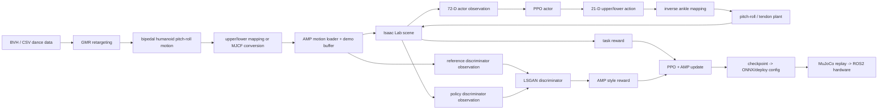
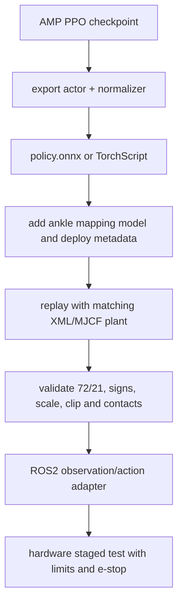

<p align='center'><a href='#zh'>中文</a> | <a href='#en'>English</a></p>
<a id='zh'></a>

# 跳舞半身训练架构（AMP + Upper/Lower）

## 1. 项目定位

本项目训练双足人形机器人的 upper/lower 踝执行器接口舞蹈策略。仿真机器人仍以 `ankle_pitch_joint` 和 `ankle_roll_joint` 作为动力学关节，但 policy-facing 的踝关节位置/速度和动作被转换为四个 upper/lower 槽位，再映射回物理 pitch/roll。

项目使用 AMP（Adversarial Motion Priors）约束动作风格，任务奖励负责速度、姿态、脚步和安全约束。AMP 判别器看到的是当前策略状态与参考 demo 状态，actor 只接收部署时可获得的观测；两者不能混为一个输入向量。

| 项目项 | 内容 |
|---|---|
| 实体框架 | `framework/legged_lab_upper_lower` |
| 主要算法 | AMP + PPO + LSGAN discriminator |
| policy 输入 | 默认单帧 `72`，变体保持相同维度 |
| action | `21` 个 policy-facing 关节动作 |
| 物理/策略频率 | `500 Hz / 100 Hz` |
| 踝接口 | `left/right_ankle_upper_joint`、`left/right_ankle_lower_joint` |
| 主要任务 | `UpperLower-v0`、`MlpUpperLower-v0`、`XmlTendonUpperLower-v0`、`MJCF-UpperLower-v0` |

## 2. AMP 和 upper/lower 原理

AMP 的核心是让 discriminator 区分“参考动作片段”和“策略生成片段”。策略同时受到普通 task reward 与 style reward 约束：task reward 让机器人完成速度/姿态/足端目标，AMP style reward 让状态分布接近 demo 的运动风格。当前配置使用 `style_reward_scale=5.0`、`task_style_lerp=0.4` 和 LSGAN 形式；这些是算法层参数，不是 `RewardTermCfg` 中的普通环境奖励。

踝部转换链为：

```text
physical ankle pitch/roll state
        ↓
polynomial / weighted MLP / XML tendon mapping
        ↓
policy-facing upper/lower observation
        ↓
21-D policy action in upper/lower semantics
        ↓
inverse mapping to pitch/roll target or torque
        ↓
MJCF/URDF plant and PD controller
```

四种变体的边界如下：

| 变体 | 状态/动作转换 | 适用 plant |
|---|---|---|
| Polynomial | 拟合的 pitch/roll ↔ upper/lower 多项式模型 | URDF pitch/roll training plant |
| Weighted MLP | weighted MLP 学习状态/力矩映射 | 对应 MLP 模型和脚本 |
| XML tendon | MJCF tendon geometry solver | XML tendon plant |
| Direct MJCF | 不做外部踝映射，直接在 upper/lower plant 训练 | upper/lower MJCF |

## 3. 总体流程图



## 4. 训练框架构成

| 层 | 实现 | 作用 |
|---|---|---|
| Motion/animation | `manager_based_animation_env_cfg.py`、motion loader | 读取参考动作并按时间采样 |
| Actor observation | `base_ang_vel`、`projected_gravity`、command、joint state、last action | 部署可获得的策略输入 |
| Critic observation | actor state 加 privileged base velocity 等训练信息 | 只用于 value 学习，部署不输入 |
| Discriminator | 当前状态序列与 demo 参考序列 | 学习运动风格分布 |
| Ankle IO | `Lens110UpperLowerJointPositionActionCfg` 和 mapping model | upper/lower 与 pitch/roll 之间的正逆变换 |
| Task reward | 速度、站高、姿态、脚步、限位、能耗、安全 | 完成任务且不损坏机器人 |
| AMP reward | LSGAN discriminator style reward | 使动作像参考数据 |
| PPO runner | rollout、GAE、actor/critic 更新、AMP discriminator 更新 | 训练策略和价值函数 |
| Export/replay | checkpoint、ONNX、MJCF/XML、配置 | 验证仿真到部署的接口一致性 |

主要源码入口为 `framework/legged_lab_upper_lower/source/legged_lab/legged_lab/tasks/locomotion/amp/config/lens110/` 下的 `lens110_upper_lower_env_cfg.py`、`lens110_mlp_upper_lower_env_cfg.py`、`lens110_xml_tendon_upper_lower_env_cfg.py` 和 `lens110_mjcf_upper_lower_env_cfg.py`。

## 5. Observation 函数和维度

### 5.1 Actor policy observation

| Observation term | 维度 | 函数/语义 |
|---|---:|---|
| `base_ang_vel` | 3 | 根部角速度 |
| `projected_gravity` | 3 | 机体坐标系中的重力方向，用于姿态估计 |
| `velocity_commands` | 3 | `base_velocity` 的 x/y/yaw 指令 |
| `joint_pos` | 21 | 相对默认关节位置；upper/lower 变体调用 `joint_pos_upper_lower_rel` 或对应 tendon/MLP 函数 |
| `joint_vel` | 21 | 相对关节速度；upper/lower 变体调用对应转换函数 |
| `actions` | 21 | 上一时刻 action |
| **总计** | **72** | `3+3+3+21+21+21` |

upper/lower 变体在 21 个位置中保留四个显式踝槽位：`left_ankle_upper_joint`、`left_ankle_lower_joint`、`right_ankle_upper_joint`、`right_ankle_lower_joint`。其余关节保持双足人形机器人 policy 顺序。观测噪声在训练中按配置注入，PLAY/导出前必须核对是否关闭。

### 5.2 Critic、AMP discriminator 和 demo observation

- critic 使用独立特权观测组，包含 actor 状态以及真实 base linear velocity；默认 critic history 为 3，特权项不能直接带入真机 actor。
- discriminator 当前状态组默认包含根部角速度、关节位置和关节速度，并按配置维护时间历史；demo 组使用 animation/reference 的对应状态。默认 AMP discriminator history 为 10，具体输入形状以运行时导出探针为准。
- demo 的踝关节位置/速度也必须经过与 policy 相同的 Polynomial、MLP 或 XML tendon 转换，不能拿 pitch/roll demo 与 upper/lower policy 状态直接比较。

## 6. Action 和执行器映射

policy 输出 21 个归一化 action，动作管理器先应用默认位置偏置、scale 和 clip，再把四个踝槽位转换为物理目标。当前公共配置中的典型缩放为：torso yaw `0.125`、肩部/肘部 `0.18`、其余关节约 `0.25`；upper/lower 踝槽位还使用各自 clip 区间。

```text
a_policy[21] -> scale/clip/default offset
            -> upper/lower ankle inverse model
            -> q_target_pitch_roll or tendon target
            -> PD torque / actuator plant
```

必须同时保存 policy、mapping model、mapping 版本、左右脚顺序、符号约定、scale、clip 和 XML/URDF。只替换 policy 而不替换映射模型，会造成踝方向或幅值错误。

## 7. Reward 函数由什么构成

本项目总目标可以理解为 `R_total = R_task + R_amp_style`。`R_task` 由环境 RewardManager 汇总；`R_amp_style` 由 discriminator 根据策略状态与 demo 状态的相似度产生。以下是当前双足人形机器人 AMP 任务层配置中的主要项：

| 类别 | Reward term / 语义 | 权重 |
|---|---|---:|
| 速度 | `track_lin_vel_xy_exp` | `+1.25` |
| 速度 | `track_ang_vel_z_exp` | `+1.25` |
| 生存 | `alive` | `+0.10` |
| 稳定 | `ang_vel_xy` | `-0.10` |
| 稳定 | `flat_orientation` | `-1.0` |
| 稳定 | `base_height` | `-2.0` |
| 动力学 | `joint_vel` | `-2e-4` |
| 动力学 | `joint_acc` | `-2.5e-7` |
| 平滑 | `action_rate` | `-0.01` |
| 安全 | `joint_limits` | `-1.0` |
| 安全 | `torques` | `-1e-5` |
| 姿态 | `joint_regularization` | `-2e-3` |
| 姿态 | hip deviation | `-0.03` |
| 姿态 | arm/torso deviation | `-0.025 / -0.01` |
| 对称 | arm symmetry | `-0.04` |
| 对称 | arm velocity symmetry | `-0.001` |
| 对称 | hip yaw symmetry | `-0.15` |
| 足端 | `feet_air_time` | `+0.60` |
| 足端 | `feet_slide` | `-0.12` |
| 足端 | sound/footstep consistency | `-1e-4` |
| 足端 | feet distance | `+0.15` |
| 足端 | knee distance | `+0.10` |
| 接触 | undesired contacts | `-1.0` |
| 终止 | termination penalty | `-1.0` |
| 风格 | AMP discriminator style | `style_reward_scale=5.0` |

跟踪项一般采用指数误差，正则项使用 L1/L2、接触或限位函数；具体函数定义和 term 名称以配置文件为准。终止条件（摔倒、坏姿态、非法接触或 episode 结束）由 TerminationManager 处理，不应当被误解为普通正奖励。

## 8. 数据、实验和导出

```text
data/
├── raw/bvh/                         # 原始舞蹈动作
├── processed/retargeted_actions/    # pitch/roll retargeted motion
├── models/pitchRoll2UpperLower/     # 映射模型和校准资料
└── training/motion_data/             # AMP loader 直接读取的 motion
experiments/runs/                    # AMP TensorBoard/checkpoints
exports/training_exports/            # 训练输出入口
exports/versions/                    # policy、mapping、XML、deploy config
docs/REWARD_STRUCTURE.md             # 奖励证据
docs/TRAINING_ARCHITECTURE.md        # 本文
```

## 9. 本地训练与复现

```bash
./projects/02_dance_half_body/scripts/train.sh --headless --num_envs 2048 --max_iterations 200000
```

选择变体时只替换对应 `--task` 和对应 mapping/plant；不要跨 Polynomial、MLP、XML tendon、Direct MJCF 复用 checkpoint。训练前后必须记录任务 ID、mapping model path、ankle joint order、obs/action shape、随机种子、环境数量、checkpoint 和 MuJoCo replay 时长。

## 10. 导出、MuJoCo 和真机部署



部署包必须包含与 policy 匹配的 mapping model 和 plant。真机 actor 只接收 72 维可测观测，不使用 critic 的 privileged velocity 或仿真接触真值。MuJoCo 根四元数使用 `wxyz`，GMR/部署 CSV 使用 `xyzw`，转换必须在明确的边界脚本中完成。

## 11. 复现验收清单

- [ ] 四个 upper/lower 踝槽位名称、左右顺序和符号已核对。
- [ ] actor 为 72 维、action 为 21 维，历史和 normalization 与导出一致。
- [ ] critic/discriminator/demo 观测没有误接到硬件 actor。
- [ ] Polynomial、MLP、XML tendon、Direct MJCF 的 policy、mapping、plant 没有混用。
- [ ] AMP style reward、task reward、终止条件在日志中分开记录。
- [ ] MuJoCo replay 已通过，且导出包包含完整本地依赖和部署元数据。
- [ ] 真机先静态站立，再小幅动作，再短舞蹈；急停、限位、电流和温度监控有效。

<a id='en'></a>

# Half-Body Dance Training Architecture (AMP + Upper/Lower)

## Scope

This repository trains the bipedal humanoid robot upper/lower ankle policy interface. The simulated robot still owns physical ankle pitch/roll joints, while policy observations and actions expose four upper/lower ankle slots. Polynomial, weighted MLP, XML tendon, and direct MJCF variants are separate plants and checkpoint contracts.

The training stack is Isaac Lab/LeggedLab with PPO and AMP. Task rewards handle velocity, posture, feet, limits, smoothness, energy, and contacts. An LSGAN discriminator compares policy state sequences with reference demo sequences and supplies the style reward. The configured style scale is `5.0` and task/style blending is controlled by `task_style_lerp=0.4`.

## Observation and action

The default actor observation is 72 dimensions: 3 base angular velocity, 3 projected gravity, 3 velocity-command values, 21 relative joint positions, 21 relative joint velocities, and 21 previous actions. Upper/lower variants replace the ankle portions with the corresponding mapping functions while preserving the 21-slot policy order. The action has 21 entries and is scaled, clipped, and inverse-mapped to physical pitch/roll or tendon targets.

The critic has privileged training-only state and a default history of three. The AMP discriminator and demo groups maintain their own sequences, with a default discriminator history of ten. These groups must not be copied into the hardware actor.

## Reward

The task reward contains linear/angular velocity tracking (`+1.25/+1.25`), alive (`+0.10`), orientation/base-height/angular-rate costs, joint velocity/acceleration, action rate, torque, limits, posture and symmetry costs, feet air-time (`+0.60`), slide (`-0.12`), feet/knee distance, undesired contact, and termination terms. The discriminator style reward is an algorithm-level term scaled by `5.0`; it is not an ordinary `RewardTermCfg` entry.

## Reproduction and deployment

Run `./projects/02_dance_half_body/scripts/train.sh --headless --num_envs 2048 --max_iterations 200000` in the local Isaac Lab environment. Keep the mapping model, checkpoint, XML/MJCF plant, action scale, clips, joint order, normalization, and replay result together. Export the actor with its normalizer, then replay using the same ankle mapping and plant before any staged ROS2 hardware test. MuJoCo uses `wxyz` root quaternions while GMR/deployment CSV uses `xyzw`.
